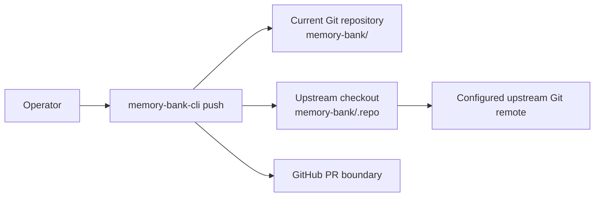

# FT-023: Design

## Design Pack

| Artifact | Role | Owns |
| --- | --- | --- |
| `design.md` | Feature-local solution owner | `SOL-*`, `ALT-*`, `TRD-*`, `C4-*`, `SD-*`, `CTR-*`, `INV-*`, `FM-*`, `RB-*` and design verification |

## Context

`REQ-01`–`REQ-05` cross the current repository, a nested upstream checkout, an upstream Git remote and GitHub PR creation. The accepted FPF decisions in `decision-log.md` prefer a small auditable publish set and compensation rather than fictional distributed atomicity.

## C4 Applicability

| C4 ID | Decision | Trigger / reason | Artifact |
| --- | --- | --- | --- |
| `C4-01` | `C1` | `push` introduces upstream Git and GitHub external/trust boundaries. | embedded system-context view |

The CLI reads downstream source, validates and temporarily mutates only the named upstream checkout, pushes only a new upstream branch, then requests a PR. The default branch is never a write target.

## Architecture Coverage Decision

| Aspect | Status | Canonical refs | Coverage note |
| --- | --- | --- | --- |
| Components / responsibilities | covered | `SOL-01`–`SOL-03` | CLI orchestrates; selector plans; Git executor acts after preflight; PR client creates PR. |
| Connectors / interactions | covered | `CTR-01`–`CTR-03` | Filesystem, local Git, remote Git and GitHub boundaries are explicit. |
| Configuration / topology | covered | `SOL-02`, `CTR-02` | `.repo` is the only checkout binding; its upstream identity is validated, not hard-coded. |
| Behavioral semantics | covered | `SD-01`–`SD-03`, `INV-*`, `FM-*`, `RB-01` | Selection, dry-run and compensation semantics are canonical below. |
| Quality / evolution concerns | covered | `CON-01`–`CON-03`, `INV-*`, `FM-*`, `RB-01` | Fail-closed selection, path safety, default-branch protection and recoverable residual state are specified. |

## Selected Solution

- `SOL-01` Add `memory-bank-cli push [--dry-run]`. Resolve the current Git root, read changed paths under `memory-bank/`, and produce an inclusion/exclusion plan before mutation.
- `SOL-02` Treat `memory-bank/.repo` as the only upstream checkout. Validate safe path, clean/conflict-free Git state, upstream remote/identity and non-default branch before applying a plan to a newly created branch.
- `SOL-03` Create the GitHub PR only after push. On any post-preflight failure follow `SD-02`; output includes plan and PR URL, while dry-run has no mutation.

## Alternatives Considered

| Alternative ID | Option | Why not selected |
| --- | --- | --- |
| `ALT-01` | Include `adapted` or `user-owned` paths by default. | Current ownership facts label them project-facing; default inclusion can publish project-specific content. |
| `ALT-02` | Claim an all-or-nothing transaction across local Git, remote Git and GitHub. | They are separate systems; no such atomic connector exists. |
| `ALT-03` | Direct push to upstream default branch. | Contradicts `NS-02` and issue #23. |

## Trade-offs

| Trade-off ID | Decision | Benefit | Cost / Risk |
| --- | --- | --- | --- |
| `TRD-01` | Managed-only publication. | Prevents accidental publication of project-facing/unknown content. | Desired adapted content is omitted and must follow a separately reviewed path. |
| `TRD-02` | Compensating rather than atomic transaction. | Bounded rollback and honest diagnostics across independent systems. | Failed compensation can leave a named unmerged remote branch. |

## Accepted Local Decisions

- `SD-01` A path is publishable only when safely normalized below `memory-bank/` and its current class is exactly `managed`; every other class is reported as excluded. Failed normalization/classification aborts before mutation.
- `SD-02` Preflight first; use only a fresh non-default branch; after failure restore original local branch/HEAD and attempt remote deletion only for the command-created branch. Failed compensation is a diagnosed failed outcome, never a default-branch write.
- `SD-03` `standard` validation requires targeted contract tests, full Go suite, vet, navigation audit and one approved live PR result; the latter is a closure gate, not a unit-test substitute.
- `SD-04` The source namespace is always downstream `memory-bank/`; before mutation `.repo` must resolve as its own Git worktree and the selected `origin/default` tree must contain exactly one real payload root, `memory-bank-template/` or legacy `memory-bank/`. The planner translates only the leading namespace and rejects missing, duplicate or symlink payload roots.

## Contracts

| Contract ID | Connector / direction | Roles and sync boundary | Guarantees / failure / evolution semantics |
| --- | --- | --- | --- |
| `CTR-01` | Filesystem: downstream `memory-bank/` → selection planner → upstream payload root | CLI reads current repository synchronously | Only exactly-`managed` normalized paths enter plan; `.lock`, `.repo` and all other classes are excluded. The source prefix translates to exactly one validated upstream `memory-bank-template/` or `memory-bank/` root; invalid topology aborts. |
| `CTR-02` | Local Git and remote Git: CLI → `.repo` → configured upstream | Synchronous local/remote boundary | Preflight validates repository, safe path, clean state, conflicts, remote identity and default branch; writes only fresh branch; failure runs `SD-02`. |
| `CTR-03` | GitHub PR: CLI → configured upstream repository | External authenticated boundary after push | Success returns URL; failure triggers `CTR-02` compensation; dry-run never crosses boundary. |

## Invariants

- `INV-01` No selected source path is outside `memory-bank/` or outside exactly-`managed` ownership.
- `INV-02` The upstream default branch is never directly checked out for write, committed to or pushed by `push`.
- `INV-03` `--dry-run` mutates neither local checkout, remote Git nor GitHub.
- `INV-04` Failure reports residual state and recovery action; success requires a PR URL.

## Failure Modes and Backout

- `FM-01` Unsafe/missing/dirty/conflicted `.repo` or invalid remote/identity: stop in preflight with actionable diagnostic and no mutation.
- `FM-02` Commit, push or PR creation fails after an earlier effect: restore local checkout, attempt deletion only of the command-created remote branch, and report exact residual state if cleanup fails.
- `FM-03` Source path cannot be normalized/classified: stop before mutation rather than guessing.

| Stage ID | Stage | Entry condition | Backout |
| --- | --- | --- | --- |
| `RB-01` | Run only after accepted plan and required validation. | Local checks green; live PR has explicit human approval. | Apply `SD-02`; default branch remains unchanged; operator inspects/deletes named residual branch if needed. |

## Design Verification

| Analysis | Required | Method | Result / evidence |
| --- | --- | --- | --- |
| Contract compatibility | yes | FPF consequence review plus contract tests | `decision-log.md`; `CHK-01`–`CHK-05` evidence required before closure |
| State / transition completeness | yes | Walk through preflight → branch → commit → push → PR → compensate | all outcomes recorded in `SD-02`, `FM-*`; validate with `CHK-04` |
| Failure propagation | yes | Failure-mode review and injected-failure tests | `FM-01`–`FM-03`, `CHK-02`, `CHK-04` |
| Concurrency / ordering | yes | Pin/revalidate preconditions and sequential Git-command tests | reject state changes before mutation; `CHK-04` |
| Security boundaries | yes | Path/remote validation review and negative tests | `CTR-02`, `FM-01`, `CHK-02` |
| Capacity / latency | no | One bounded operator-triggered Git operation; no new service/load path | N/A |
| Migration / evolution safety | yes | CLI regression and non-default-upstream tests | `CHK-01`, full suite |

## ADR / External Design Dependencies

No ADR is required: the choices are feature-local and do not redefine a shared architectural boundary.

## Traceability

| Requirement ID | Solution refs | Contracts / invariants | Failure / rollout refs |
| --- | --- | --- | --- |
| `REQ-01` | `SOL-01`, `SD-03`, `C4-01` | `CTR-01`, `INV-03` | `FM-03`, `RB-01` |
| `REQ-02` | `SOL-02`, `SD-02` | `CTR-02`, `INV-02` | `FM-01`, `FM-02`, `RB-01` |
| `REQ-03` | `SOL-01`, `SD-01` | `CTR-01`, `INV-01` | `FM-03` |
| `REQ-04` | `SOL-02`, `SOL-03`, `SD-02` | `CTR-02`, `CTR-03`, `INV-02`, `INV-04` | `FM-02`, `RB-01` |
| `REQ-05` | `SOL-01`, `SOL-03`, `SD-03` | `CTR-02`, `CTR-03`, `INV-03` | `FM-01`, `FM-02`, `RB-01` |
