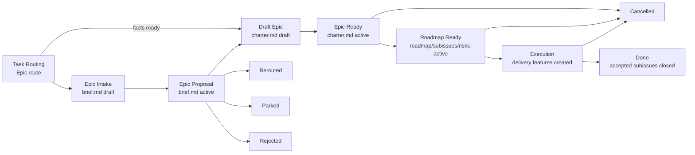

# Epic Flow

Epic - это управляемая инициатива крупнее одной delivery-feature. Он задаёт общий intent, границы, roadmap, решения, риски и subissue registry, но не подменяет feature package и не содержит code-level execution plan. Если Epic route уже выбран, но facts ещё недостаточны для полного setup, flow начинается с **Epic Intake**; его состояние **Epic Proposal** фиксируется в обязательном для Intake `brief.md`. `brief.md` можно не создавать только при пропуске Intake и прямом переходе к Bootstrap Epic.

FPF-основание:

- **Bounded Contexts**: epic делит большую инициативу на смысловые контексты и delivery-slices, чтобы не смешивать бизнес, операции, финансы, UI/API и реализацию.
- **Strict Distinction**: epic, feature, PRD, use case, ADR и implementation plan имеют разные owners и не должны подменять друг друга.
- **Evidence Graph**: epic решения должны ссылаться на источники, stakeholder answers, specs, ADR или code facts.
- **Q-Bundle**: качество epic нельзя свести к одному score; оно проверяется набором отдельных свойств ниже.

## Package Rules

1. Все документы одного epic живут в `memory-bank/epics/EP-XXX/`.
2. `README.md` - routing layer и annotated index. Он создаётся первым, содержит `epic_stage` и обеспечивает reachability даже для intake-only package.
3. `brief.md` - обязательный Epic Intake owner: source/trigger, problem, outcome, rough scope/non-scope, Epic route hypothesis, candidate slices, open questions и proposal disposition. Он отсутствует только если Intake пропущен. После promotion он не владеет canonical epic facts.
4. `charter.md` - canonical owner intent: problem, outcome, scope/non-scope, stakeholder channels, source/evidence boundaries.
5. `roadmap.md` - execution order owner: waves, gates, dependencies, stop rules and handoff protocol.
6. `decision-log.md` - local decision ledger for decisions that affect the epic but do not require global ADR.
7. `subissues.md` - registry of candidate and accepted delivery subissues, each mapped to roadmap waves and source `SLICE-*`/`UC-*`.
8. `risks.md` - epic-level risk register for financial, operational, scope and delivery risks.
9. `design.md`, `specs/**`, `diagrams/**`, `source-docs/**` — опциональные knowledge-артефакты. Они допустимы только когда индексируются из epic package и подчиняются правилам knowledge-артефактов ниже.
10. `implementation-plan.md` не создаётся внутри epic. Code-level execution belongs to a separate `memory-bank/features/FT-<issue>/` package.
11. Для epic package используй templates from `memory-bank/flows/templates/epic/`.

## Layer Model

| Layer | Primary docs | Owns | Must NOT define |
| --- | --- | --- | --- |
| Intake | `README.md`, required `brief.md` | package stage, early proposal facts, open questions and disposition | authoritative roadmap, accepted subissues, selected solution, risk controls, feature acceptance or implementation sequence |
| Intent | `charter.md` | business/problem frame, scope, non-scope, source evidence, stakeholder channels | file paths, code steps, final implementation sequence |
| Roadmap | `roadmap.md`, `subissues.md` | waves, dependencies, issue candidates, handoff gates | final code plan, exact migrations, test commands |
| Governance | `decision-log.md`, `risks.md` | local decisions, risk controls, stop rules | global architecture policy unless promoted to ADR |
| Knowledge | `design.md`, `specs/**`, `diagrams/**`, linked `UC-*` | bounded contexts, source-backed specs, contracts, scenario coverage | delivery issue ownership or code execution |
| Execution | future `features/FT-<issue>/` | one approved delivery change with tests and rollout | reopening epic scope without updating epic owners |

## Правила Knowledge-Артефактов

Knowledge-артефакты существуют только для нормализации evidence в инициативе из нескольких фич. Они не заменяют `charter.md`, `roadmap.md`, `decision-log.md`, `subissues.md` или `risks.md`.

1. Любой markdown knowledge artifact внутри `memory-bank/epics/EP-XXX/` должен быть связан из package `README.md` или из linked epic owner document, чтобы reachability оставалась явной.
2. Markdown knowledge artifacts используют YAML frontmatter с `doc_kind: epic`, `doc_function: reference`, `status` и `derived_from`.
3. `derived_from` указывает на epic owner, чей факт нормализуется (`charter.md`, `roadmap.md`, `decision-log.md`, `subissues.md`, `risks.md`), и на external/source references, когда они релевантны.
4. Knowledge artifacts могут определять local reference IDs для source excerpts, context maps, diagrams или normalized specs, но не должны определять roadmap waves, subissue status, risk controls, accepted global architecture decisions или code execution steps.
5. `source-docs/**` используется для source-backed references или ссылок. Если source material копируется в repo как Markdown, он следует этим frontmatter и reachability rules.

## Lifecycle

## Transition Gates

### Enter Epic Intake

Этот этап optional: если routing input уже достаточен для `charter.md`, сразу переходи к `Bootstrap Epic`.

- [ ] Task Routing выбрал Epic route по multi-feature scope, shared roadmap, cross-feature risk или нескольким delivery units
- [ ] создан `memory-bank/epics/EP-XXX/README.md` с `epic_stage: epic_intake`
- [ ] создан `brief.md` с `status: draft` и `proposal_status: pending`
- [ ] source/trigger и proposal owner указаны
- [ ] зафиксирована проверяемая гипотеза, почему инициатива требует Epic Flow
- [ ] `implementation-plan.md`, accepted subissues и delivery `FT-*` packages отсутствуют

### Epic Intake -> Proposal Ready

- [ ] `brief.md` имеет `status: active` и `proposal_status: pending`
- [ ] problem, observable outcome, rough scope/non-scope и available evidence записаны
- [ ] candidate delivery slices используют `BR-SLICE-*` и не представлены как approved `EP-SI-*` или `FT-*`
- [ ] open questions показывают, каких facts не хватает для approval и canonical owners
- [ ] указан decision owner, который может выбрать disposition
- [ ] proposal не определяет roadmap waves, risk controls, selected solution, feature acceptance contracts или implementation sequence
- [ ] package `README.md` имеет `epic_stage: proposal_ready`

### Proposal Ready -> Draft Epic

- [ ] decision owner подтвердил disposition `approved`
- [ ] `charter.md` создан со `status: draft`
- [ ] подтверждённые problem/outcome/scope/non-scope перенесены в `charter.md`, а не скопированы как второй active owner
- [ ] для candidate slices заполнен promotion map; если draft `roadmap.md` или `subissues.md` уже созданы, slices перенесены туда только как candidates
- [ ] material risks и local decisions перенесены в соответствующие owners; risk controls впервые определены в `risks.md`, а не перенесены из proposal
- [ ] `brief.md` содержит promotion map, ссылки на новых owners, `proposal_status: approved` и `status: archived`
- [ ] package `README.md` имеет `epic_stage: draft`

### Proposal Disposition Without Epic Bootstrap

- **Rerouted:** укажи новый route и ссылку на его owner artifact; установи `proposal_status: rerouted`, `status: archived`, `epic_stage: rerouted`.
- **Parked:** запиши причину, owner и review trigger/date; установи `proposal_status: parked`, `epic_stage: parked`. Delivery не начинается, brief остаётся текущим intake owner.
- **Rejected:** запиши decision owner, rationale и evidence; установи `proposal_status: rejected`, `status: archived`, `epic_stage: rejected`.

Во всех трёх исходах должны отсутствовать accepted epic subissues, delivery feature packages и implementation sequence, созданные только на основании proposal.

### Bootstrap Epic

- [ ] `README.md` создан
- [ ] `charter.md` создан
- [ ] package `README.md` имеет `epic_stage: draft`
- [ ] если intake был пропущен, source/trigger и основание Epic route зафиксированы в `charter.md` или linked issue
- [ ] `implementation-plan.md` отсутствует
- [ ] если source docs уже известны, они отделены от derived specs

### Draft -> Epic Ready

- [ ] `charter.md` имеет `status: active`
- [ ] package `README.md` имеет `epic_stage: epic_ready`
- [ ] scope/non-scope explicit
- [ ] source/evidence boundaries explicit
- [ ] stakeholder channels and decision process recorded
- [ ] known out-of-scope topics recorded to prevent reopening

### Epic Ready -> Roadmap Ready

- [ ] `roadmap.md` active and names execution waves
- [ ] `subissues.md` active and maps candidates to waves/slices
- [ ] `risks.md` active and names controls/owners
- [ ] `decision-log.md` active when non-trivial decisions exist
- [ ] first delivery feature can be created without inventing epic-level facts
- [ ] package `README.md` имеет `epic_stage: roadmap_ready`

### Roadmap Ready -> Execution

- [ ] выбран один approved subissue or delivery slice
- [ ] created/selected GitHub issue is linked to epic package
- [ ] new `memory-bank/features/FT-<issue>/` package exists
- [ ] новый feature package импортирует только релевантные epic refs (`charter.md`, `roadmap.md`, `subissues.md`, `risks.md` и `decision-log.md`, если используется), а не весь epic scope
- [ ] feature `brief.md`, optional `design.md`, затем `implementation-plan.md` следуют `feature.md`
- [ ] package `README.md` имеет `epic_stage: execution`

### Execution -> Done

- [ ] каждый accepted subissue завершён, отменён или явно передан в отдельную инициативу
- [ ] delivered feature packages достигли своих terminal states и связаны из `subissues.md`
- [ ] фактический outcome сопоставлен с `charter.md` acceptance и записан в его `Outcome`/`Acceptance`
- [ ] `roadmap.md`, `subissues.md` и `risks.md` отражают финальное состояние; `decision-log.md`, если используется, также отражает финальное состояние
- [ ] открытые риски и follow-up work имеют owner и отдельные task references
- [ ] человек подтвердил закрытие инициативы
- [ ] package `README.md` имеет `epic_stage: done`; для отменённой инициативы используется `epic_stage: cancelled`

## Epic Intake Outcome / Exit Contract

### Observable Outcome

Proposal получил evidence-backed disposition и либо передан в canonical Epic setup, либо остановлен/перенаправлен без преждевременного delivery.

### Required Evidence

- source/trigger, proposal owner и decision owner;
- problem, observable outcome и обоснование Epic route;
- rough scope/non-scope, candidate slices, available evidence и open questions;
- disposition, rationale и decision reference;
- promotion map для `approved`, target owner для `rerouted` или review trigger для `parked`.

### Terminal State

`Approved` передаёт инициативу в Draft Epic и архивирует intake brief после promotion. `Rerouted` и `Rejected` завершают proposal package с явным owner/reason. `Parked` не terminal: proposal остаётся governed intake record до review trigger.

### Handoff

- `Approved` -> `charter.md` и canonical epic owners.
- `Rerouted` -> owner artifact выбранного flow.
- `Parked` -> named owner и review trigger/date.
- `Rejected` -> archived proposal с decision evidence.

## Epic Delivery Outcome / Exit Contract

### Observable Outcome

Инициатива доставлена управляемыми vertical slices либо осознанно завершена с явным outcome verdict и без скрытой незавершённой работы.

### Required Evidence

- charter с outcome verdict относительно acceptance;
- финальные состояния roadmap waves, accepted subissues и feature packages;
- актуальный risk register и, если используется, актуальный decision log;
- отдельные references и owners для переданных рисков и follow-up work;
- последний review cycle для epic package завершён без открытых замечаний;
- все изменения epic package закоммичены и отправлены в remote branch, required CI полностью зелёный.

### Terminal State

`Done`: выполнен gate Execution → Done. Альтернативный terminal state — `Cancelled`, если причина, принятые последствия и судьба уже созданных subissues зафиксированы в epic owners.

### Handoff

Закрой epic initiative; перенеси устойчивые знания в их canonical owners, а незавершённые delivery или prevention items повторно маршрутизируй как самостоятельные задачи.

## Quality Bundle

Epic quality is a Q-Bundle, not one scalar.

| Quality | What must be visible | Review question |
| --- | --- | --- |
| Intake decisiveness | Proposal names decision owner, open questions and disposition evidence | Can we approve, reroute, park or reject without inventing facts? |
| Traceability | Source docs, decisions, requirements, UC and subissues linked by stable IDs | Can a reviewer trace each planned feature back to evidence? |
| Decomposability | Bounded contexts and slices are separated | Can we create one delivery issue without dragging the whole epic? |
| Roadmap clarity | Waves, dependencies, gates and stop rules are explicit | Does the team know what should happen first and why? |
| Decision provenance | Если существуют non-trivial local decisions, `decision-log.md` связывает facts, FPF reasoning и consequences | Are existing local decisions backed by evidence rather than preference? |
| Scope control | Non-scope and stop rules are explicit | Can we prevent accidental expansion during delivery? |
| Risk governance | `risks.md` lists risks, controls and owners | Are high-impact financial/operator risks visible before code? |
| Execution handoff | `subissues.md` and roadmap define feature-package inputs | Can a slice owner start without re-reading the whole epic? |
| Evidence readiness | Open facts and confidence gaps are recorded | Do we know where facts are missing and who can close them? |
| Change control | Epic changes update owner docs before downstream plans | Will scope/design drift be caught before implementation? |

## Stable Identifiers

| Prefix | Meaning | Owner |
| --- | --- | --- |
| `BR-REQ-*` | Intake rough scope item | Intake `brief.md` |
| `BR-NS-*` | Intake rough non-scope item | Intake `brief.md` |
| `BR-SLICE-*` | Candidate delivery slice before epic approval | Intake `brief.md` |
| `EP-SI-*` | Epic subissue candidate or accepted subissue | `subissues.md` |
| `W*` | Roadmap wave | `roadmap.md` |
| `HG-*` | Handoff gate before feature execution | `roadmap.md` |
| `ERISK-*` | Epic-level risk | `risks.md` |
| `DL-*` | Local decision log entry | `decision-log.md` |
| `SLICE-*` | Candidate delivery slice | epic decomposition spec |

## Boundary Rules

1. Epic may define roadmap waves, but not file-level execution steps.
2. Epic may define subissue candidates, but does not make them implementation-ready until a delivery issue and feature package exist.
3. Epic may close local decisions with FPF and evidence. If a decision changes global project architecture, create ADR.
4. Feature package, созданный из epic, должен ссылаться на релевантные `EP-*` docs и сохранять stable IDs вместо копирования всего scope. `brief.md` импортирует problem/scope refs; `design.md` или ADR импортирует epic-local decisions, когда они влияют на solution space.
5. If a feature discovers a new epic-level fact, update the epic owner document first, then update the feature.
6. Epic Intake может называть только candidate `BR-SLICE-*`. До `Roadmap Ready -> Execution` нельзя создавать delivery `FT-*` package на основании intake proposal.
7. После approved promotion `brief.md` остаётся historical intake context; canonical facts принадлежат `charter.md`, `roadmap.md`, `subissues.md`, `risks.md` и `decision-log.md`.
8. `proposal_status` принимает `pending`, `approved`, `rerouted`, `parked` или `rejected`; `epic_stage` в package README принимает значения из package README template и обновляется на каждом переходе.
