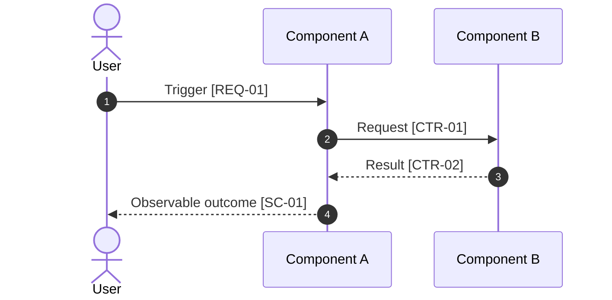

# FT-XXX: Sequence Diagram Template

Этот файл описывает wrapper-template. Инстанцируемая sequence view живет в `diagrams/<name>-sequence.md` или остается embedded в `design.md`, если компактна.

## Wrapper Notes

Создавай отдельную sequence view только когда temporal semantics действительно важна: несколько actors, sync/async boundary, callback, retry, timeout, duplicate delivery, compensation или non-trivial failure branch.

Sequence diagram является reference projection принятого решения. Он не вводит requirements, selected solution, contracts или execution steps. Все messages и branches должны ссылаться на canonical `SOL-*`, `SD-*`, `CTR-*`, `INV-*`, `FM-*`, `RB-*` или accepted ADR.

## Instantiated Frontmatter

```yaml
title: "FT-XXX: <Flow Name> Sequence"
doc_kind: feature-support
doc_function: reference
purpose: "Sequence view для <flow>. Показывает порядок взаимодействий, async boundaries и failure branches без введения новых solution facts."
derived_from:
  - ../brief.md
  - ../design.md
  # Add a delegated contract when used:
  # - ../contracts/api-contract.md
status: draft
audience: humans_and_agents
must_not_define:
  - ft_xxx_scope
  - ft_xxx_selected_design
  - canonical_contracts
  - implementation_sequence
```

## Instantiated Body

````markdown
# FT-XXX: <Flow Name> Sequence

## Role

| Field | Value |
| --- | --- |
| Flow | Какой end-to-end interaction показан |
| Trigger | Почему prose или C4 view недостаточны |
| Canonical refs | `REQ-*`, `SOL-*`, `CTR-*`, `FM-*`, ADR |
| Excluded | Какие adjacent flows намеренно не показаны |

## Participants

| Participant | Role | Boundary / owner ref |
| --- | --- | --- |
| Actor / system / component | Что делает в этом flow | `C4-*`, `SOL-*`, ADR or contract |

## Main Sequence



## Alternative / Failure Branches

| Sequence ID | Condition | Branch / response | Canonical refs |
| --- | --- | --- | --- |
| `SEQ-01` | Timeout, duplicate, invalid response or rejected state | Как flow завершается, retries, compensates or escalates | `FM-01`, `CTR-01`, `RB-01` |

## Temporal Rules

| Rule | Guarantee / constraint | Canonical refs |
| --- | --- | --- |
| Ordering | Что обязано произойти до / после | `INV-01`, `CTR-01` |
| Timeout | Когда ожидание заканчивается | `FM-01` |
| Retry | Когда повтор допустим и как сохраняется idempotency | `CTR-02` |
| Compensation | Как восстанавливается safe state | `RB-01` |

## Traceability

| Sequence refs | Requirements / scenarios | Solution / contracts | Failure / rollout |
| --- | --- | --- | --- |
| `SEQ-01` | `REQ-01`, `SC-01` | `SOL-01`, `CTR-01` | `FM-01`, `RB-01` |
````
